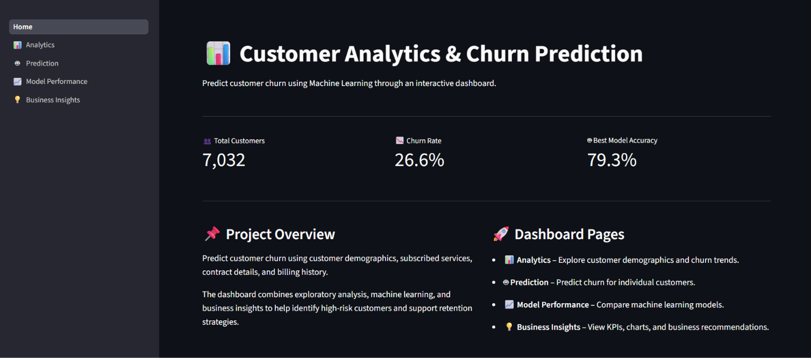
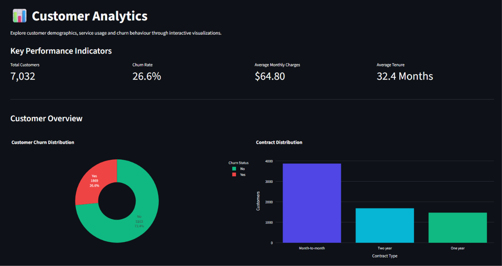
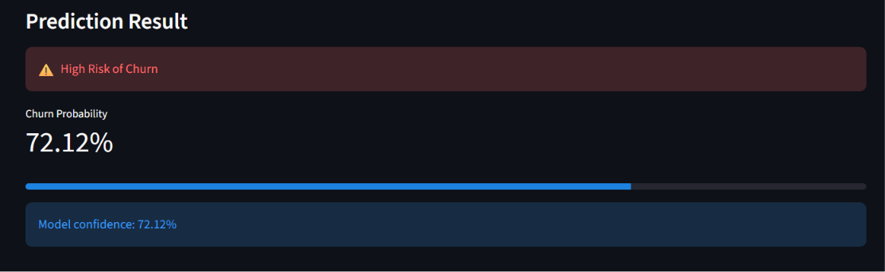
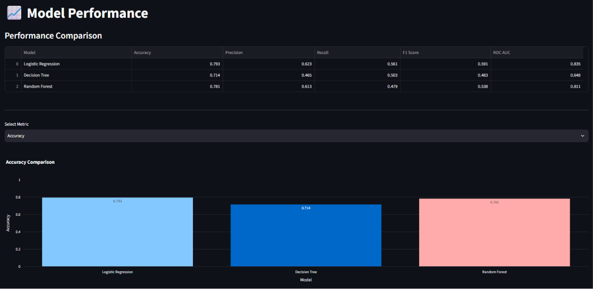

# 📊 Customer Analytics & Churn Prediction


An end-to-end Data Science project that predicts customer churn using Machine Learning and provides interactive business insights through an interactive Streamlit dashboard.

---

## 🚀 Project Overview

Customer churn is a major challenge for subscription-based businesses. This project analyzes customer behavior, identifies churn patterns, and predicts whether a customer is likely to leave using machine learning models.

The project includes a complete end-to-end machine learning pipeline, from data preprocessing and exploratory data analysis to model deployment through an interactive Streamlit dashboard.

---

## 🌐 Live Demo

**Coming Soon** *(Will be updated after Streamlit deployment.)*

---

## ✨ Features

- Data Cleaning & Preprocessing
- Exploratory Data Analysis (EDA)
- Feature Engineering
- Multiple Machine Learning Models
- Model Performance Comparison
- Customer Churn Prediction
- Interactive Streamlit Dashboard
- Business Insights & Recommendations
- Sample Customer Loader for Quick Demo

---

## 🛠 Tech Stack

### Programming Language

- Python

### Libraries

- Pandas
- NumPy
- Scikit-learn
- Plotly
- Streamlit
- Joblib
- Matplotlib
- Seaborn

---

## 📂 Dataset

**Dataset:** Telco Customer Churn Dataset

The dataset contains customer demographics, subscribed services, account information, billing details, and customer churn status.

---

## 🤖 Machine Learning Models

The following models were trained and evaluated:

- Logistic Regression
- Decision Tree
- Random Forest

## 📈 Model Performance

| Model | Accuracy |
|--------|----------|
| Logistic Regression | XX.XX% |
| Decision Tree | XX.XX% |
| **Random Forest** | **79.3%** |

The Random Forest model achieved the highest accuracy and was selected as the production model for customer churn prediction.

### Best Model

- **Random Forest**
- **Accuracy:** **79.3%**

The best-performing model is deployed in the dashboard for real-time churn prediction.

---

## 📊 Dashboard

The Streamlit dashboard consists of five pages.

### 🏠 Home

- Project overview
- Key performance indicators
- Dashboard navigation
- Model summary

### 📈 Analytics

- Customer distribution
- Churn analysis
- Interactive visualizations

### 🤖 Prediction

- Predict customer churn
- Churn probability
- Load Sample Customer feature

### 📉 Model Performance

- Compare ML models
- Accuracy
- Precision
- Recall
- F1 Score
- ROC AUC

### 💡 Business Insights

- KPI cards
- Churn by Contract Type
- Churn by Internet Service
- Business recommendations

---

# 📷 Dashboard Preview

### 🏠 Home



---

### 📊 Analytics



---

### 🤖 Prediction



---

### 📈 Model Performance



---

### 💡 Business Insights


---

## 📁 Project Structure

customer-analytics-churn-prediction/
│
├── dashboard/
│   ├── Home.py
│   ├── assets/
│   ├── components/
│   └── pages/
│
├── data/
│   └── processed/
│
├── models/
├── notebooks/
├── outputs/
├── src/
├── requirements.txt
└── README.md

## ⚙️ Installation

Clone the repository:

```bash
git clone https://github.com/harsh-k03/customer-analytics-churn-prediction.git
```

Navigate into the project:

```bash
cd customer-analytics-churn-prediction
```

Install the required packages:

```bash
pip install -r requirements.txt
```

Run the Streamlit dashboard:

```bash
streamlit run dashboard/Home.py
```

---

## 📈 Future Improvements

- Hyperparameter tuning
- SHAP explainability
- XGBoost and LightGBM implementation
- Customer segmentation
- Cloud deployment
- REST API for real-time prediction

---

## 👨‍💻 Author

**Harsh Kumar**

- GitHub: https://github.com/harsh-k03

---

## ⭐ Support

If you found this project helpful, consider giving it a ⭐ on GitHub.
